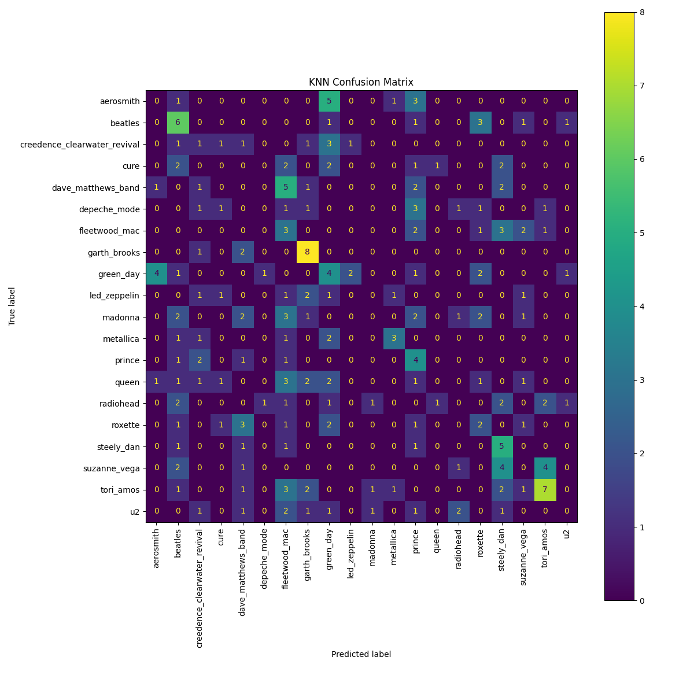
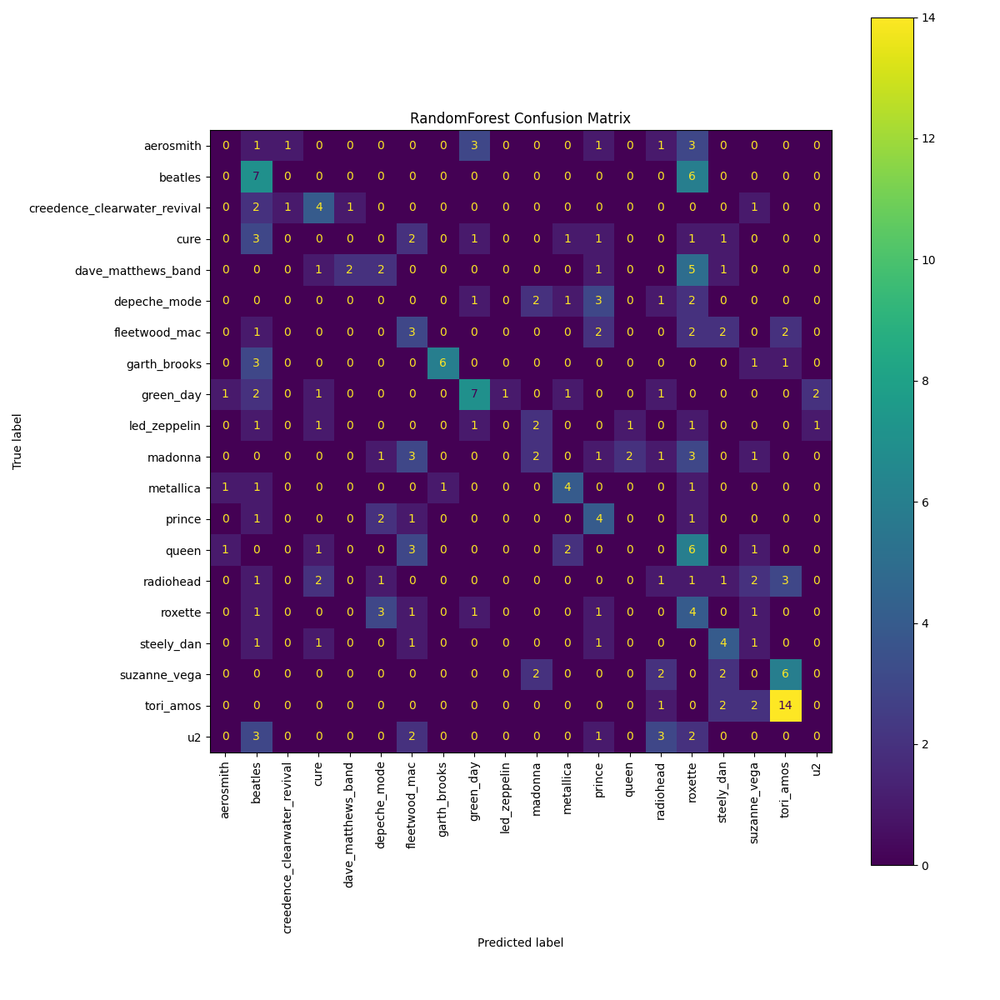
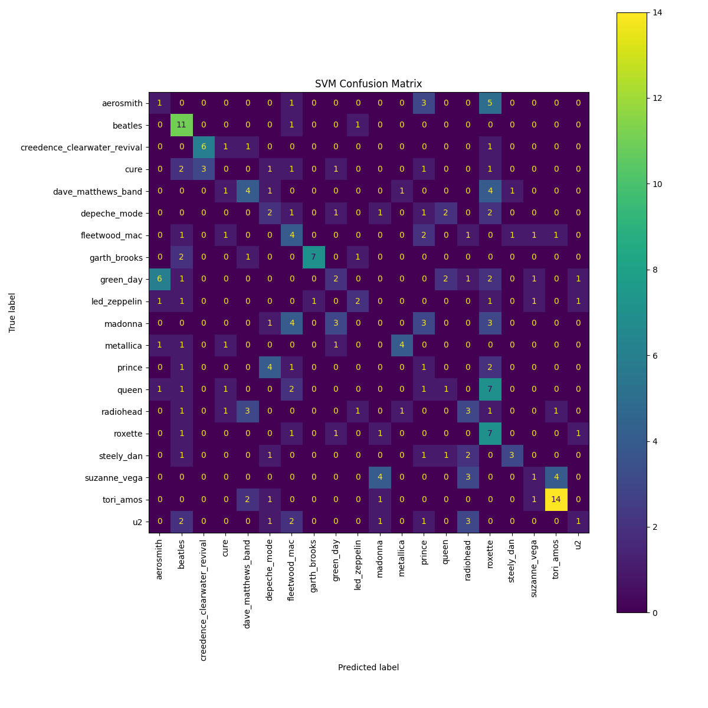
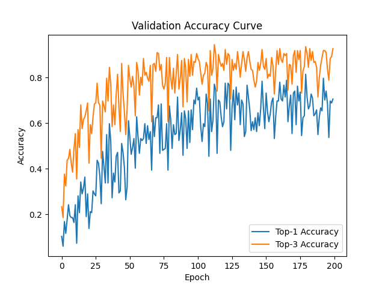
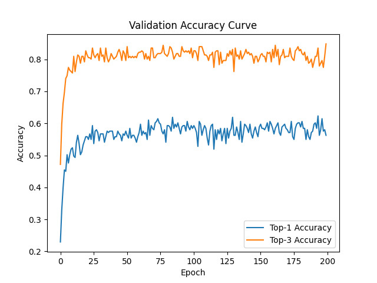

# Deep-Learning-for-Music-Analysis-and-Generation-Homework1

## 41147009S 陳炫佑

## Minimum Hardware Requirements

- **CPU:** AMD Ryzen 5 7500 or equivalent and above (6 cores, 12 threads)
- **Memory:** 16GB RAM or more  
- **Storage:** At least 20GB (for datasets and models)  
- **GPU (Recommended):** NVIDIA RTX 3090 or above, 24GB VRAM, CUDA support  
- **Operating System:** Arch Linux x86_64(Linux 6.16.10-zen1-1-zen)
- **Python Version:** 3.12.9  

## envirement set up

1. use `git clone https://github.com/minzwon/musicfm.git` for download musicFM as baseline model.
2. download dataset to `./hw1`, the directory structure is looklike:

```text
./hw1
├── artist20
│   ├── test/
│   ├── train_val/
│   ├── train.json
│   └── val.json
├── count_score.py
├── readme.md
├── test_ans.json
└── test_pred.json
```

3. download python 3.12.9 and open a new envirment for it.
4. in envirment, use `pip3 install -r ./requirements.txt` for install needed module.

## task 1
it will run knn, random forest and svm, and use grid search cv for optimize parameter
run `python3 task1.py`
and result will save to `log.txt` and all model's confusion matrix will save to `<model_name>_confusion_matrix.png`
here is my result



and best model is SVM
Top-1 Accuracy: 0.3203  Top-3 Accuracy: 0.5411

## task2

run `python3 task2.py` for model training and predicting test set, result will save to `./pred_task2.json`
run `python3 task2_baseline.py` for baseline model training

### model structure

```text
audio -> mel spectrogram
-> CNN(2 layer FC, hidden layer shape is 128) 
-> 20 classes probability
```

### model accuracy curve



### baseline structure

```text
audio -> musicFM -> embedding 
-> average pool from [time, channel] to [channel] -> MLP(2 layer FC, hidden layer shape is 128) 
-> 20 classes probability
```

### model accuracy curve

